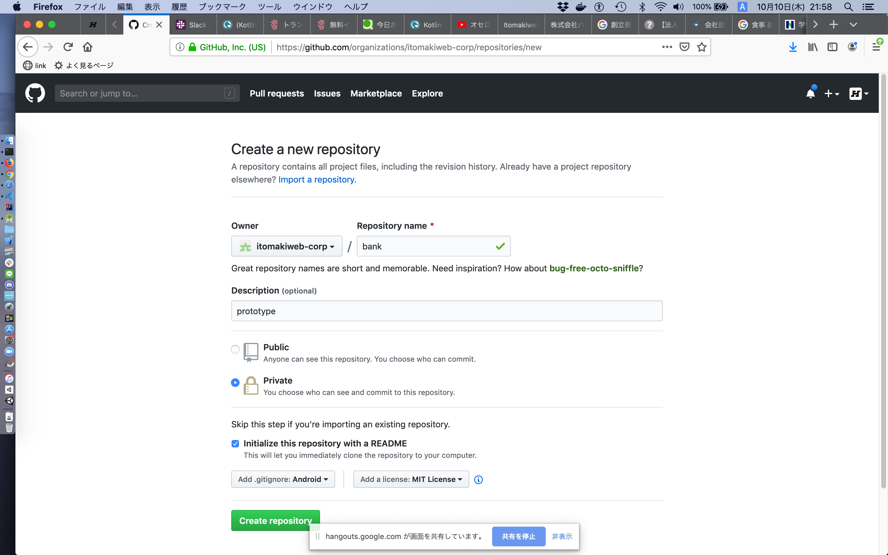

## 画面一覧

|Activity|説明|備考|
|:---|:---|:---|
|MainActivity|ゲーム一覧|-|
|BlackJackActivity|ブラックジャック詳細|-|
|HighAndLowActivity|ハイアンドロー詳細|-|
|test|test|test|

## クラス設計

|クラス|説明|備考|
|:---|:---|:---|
|DeckOfCards|トランプ一覧|-|
|TODO|TODO|-|

## memo

- リポジトリ作成スクリーンショット
  -  

## 大まかな流れ

- git checkout master
- git pull origin master
- git branches, new branch
- 修正
- emulatorなどで動作確認
- git commit
- git push
- web pull request, reviewersを指定
- web reviewersのレビューとマージ待ち
- 最初に戻る

<!---
# memo

1. test
1. test
1. test

- test
  - test
    - test
-->

## rule

|クラス|説明|備考|
|:---|:---|:---|
|ブランチ名|kebab-case|-|
|クラス名|UpperCamelCase|-|
|ID|lowerCamelCase|-|
