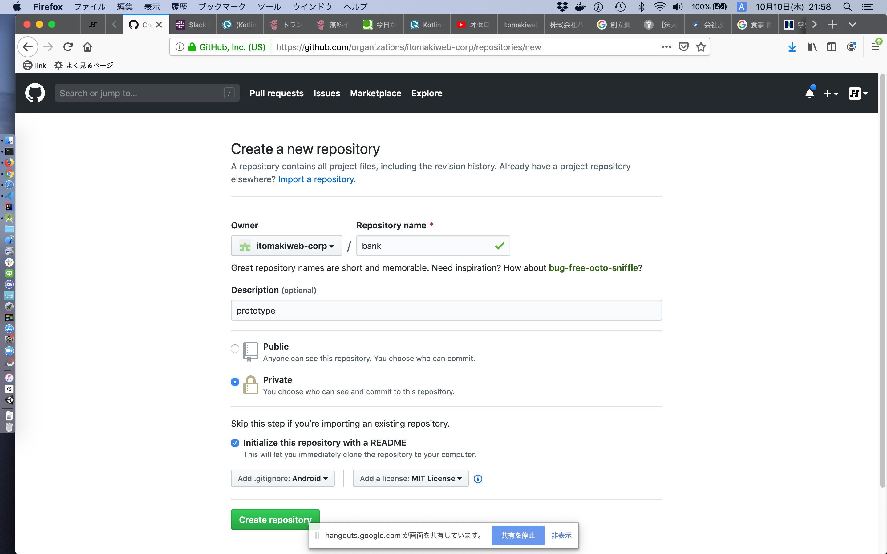

## memo

- bot
  - https://drive.google.com/open?id=15wOLmTL8HGkWKhiFjLSvUCQJPrq2jeAo-4JRuRN_R96NJSUI2UMGIB_v
    - 閲覧権限でも実行できてしまうので注意（環境変数は見られない）
- GASエディタ操作
  - Cmd + r: 実行
  - Cmd + Enter: ログ確認
- GAS環境変数
  - ファイル => プロジェクトのプロパティ => スクリプトのプロパティ　で設定可能
  - PropertiesService.getScriptProperties().getProperty(keyName)で参照
- GAS定期実行
  - https://script.google.com/home/triggers
  - https://script.google.com/home/executions
- GAS Reference
  - https://developers.google.com/apps-script/reference/url-fetch/url-fetch-app
- GitHub token
  - https://github.com/settings/tokens
  - https://developer.github.com/apps/building-oauth-apps/understanding-scopes-for-oauth-apps/
- GraphQL
  - variablesを使う場合、query()内にも定義が必要なので注意
  - https://developer.github.com/v4/explorer/
    - query詳細を入力しながら確認
  - https://employment.en-japan.com/engineerhub/entry/2018/12/26/103000
    - 概要確認
  - https://graphql.github.io/learn/queries/
    - 未読
  - コマンドラインでの実行
```
brew install jq
token="正当な値を設定"
curl -s -X POST -H "Authorization: Bearer ${token}" -H 'Accept: application/vnd.github.v4.idl' -d '{"query": "query { repository(owner:\"itomakiweb-corp\", name:\"bank\") { id, assignableUsers(first: 100) { edges { node { id, login, name } } }, labels(first: 100) { edges { node { id, name } } }, projects(first: 100) { edges { node { id, name } } }, milestones(first: 100) { edges { node { id, title } } } } }"' https://api.github.com/graphql | jq
```
- Slack token
  - https://api.slack.com/apps
  - https://api.slack.com/apps/APQQU1DQU/oauth?
  - メッセージ送信なら、デフォルトのbot権限とBot User OAuth Access Tokenで可能
  - not_authedエラー
    - BearerのBを小文字にしていたら、Slack APIにアクセスできなかった
    - GitHub APIはアクセス可能だったので、調査が難航した
    - 以下サンプルが小文字になっていたため、間違えた
    - https://developer.github.com/v4/guides/forming-calls/#communicating-with-graphql
  - channel_not_foundエラー
    - private channelは、botの招待が必要
    - サイドメニュー => App + => itomakiweb-botを表示 => @itomakiweb-botをクリック => チャンネルにこのアプリを連携
    - https://app.slack.com/client/TCWKJAQG1/DPTFFNKJA
- リポジトリ作成スクリーンショット
  -  
